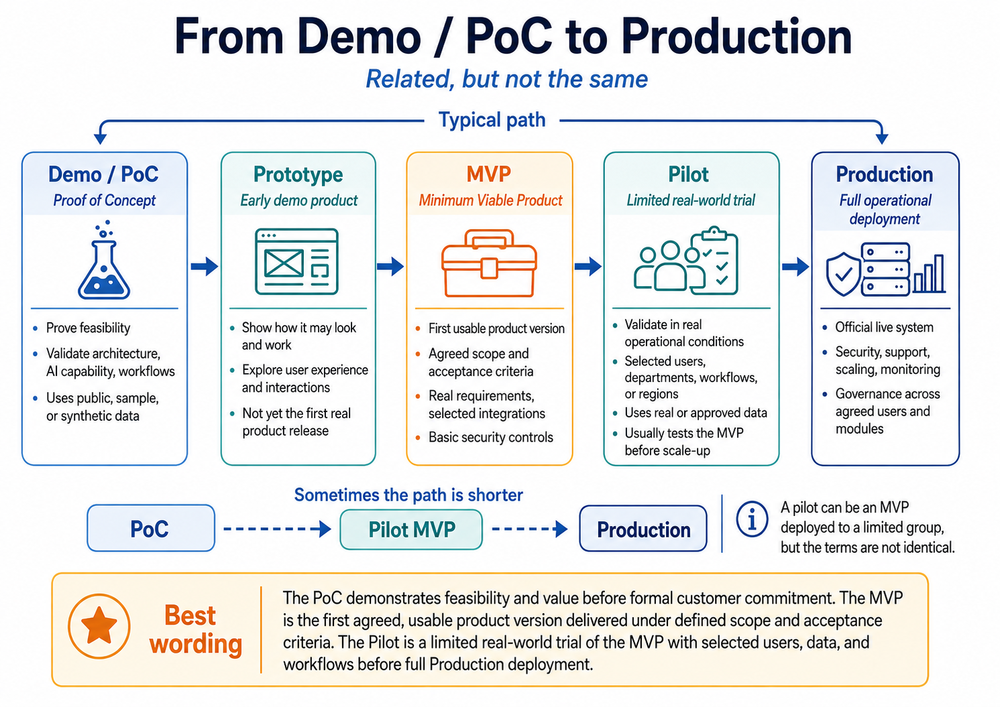

# PoC, Prototype, MVP, Pilot, and Production



<a id="contents"></a>

## Contents

1. [Core Idea](#1-core-idea)
2. [Simple Comparison](#2-simple-comparison)
3. [Delivery Journey](#3-delivery-journey)
4. [Illustrative Examples](#4-illustrative-examples)
5. [Common Shorter Path](#5-common-shorter-path)
6. [Best Wording](#6-best-wording)
7. [Active Recall Checklist](#7-active-recall-checklist)
8. [Software vs Physical Products](#8-software-vs-physical-products)
9. [B2C, B2B, and B2G Businesses](#9-b2c-b2b-and-b2g-businesses)
10. [Cross-Domain Examples](#10-cross-domain-examples)

---

## 1. Core Idea

**PoC, Prototype, MVP, Pilot, and Production are related, but they are not the same.**

Many teams use these terms interchangeably. In practice, each one answers a different question in the **product and solution delivery journey**:

- **PoC / Demo:** _Can this work?_
- **Prototype:** _How might it look and feel?_
- **MVP:** _Can this deliver real business value as a usable product version?_
- **Pilot:** _Does it work in limited real-world conditions?_
- **Production:** _Is it ready for full live operation and responsibility?_

> **Key distinction:** A PoC proves feasibility. A Prototype explores experience. An MVP delivers a usable scoped product. A Pilot validates that product in real conditions. Production is the official live operating state.

[Back to Contents](#contents)

---

## 2. Simple Comparison

| Stage | Main Purpose | Typical Scope | Key Question |
|-------|--------------|---------------|--------------|
| **Demo / PoC** | Prove feasibility of an idea, architecture, workflow, AI capability, or integration approach | Public, sample, or synthetic data; limited scope; technical validation | **Can this work?** |
| **Prototype** | Show how the solution may look and feel | User flows, screens, interactions, experience direction | **How may this work for users?** |
| **MVP** | Deliver the first usable product version | Agreed scope, real requirements, selected integrations, basic security controls, acceptance criteria | **Can this deliver real business value?** |
| **Pilot** | Trial the MVP in limited real-world conditions | Selected users, departments, workflows, data, or regions | **Does this work operationally before scaling?** |
| **Production** | Run the official live solution | Full security, support, monitoring, governance, integrations, and operational responsibility | **Can this be operated at full scale?** |

### What Each Stage Usually Means

- **Demo / PoC**
  - Demonstrates that the concept is technically or functionally feasible.
  - Often uses **sample**, **public**, or **synthetic data**.
  - Helps validate architecture, AI capability, workflow, or integration approach.

- **Prototype**
  - Shows the possible **look**, **feel**, and **interaction model**.
  - Helps stakeholders understand the user experience.
  - May be clickable or partially functional, but it is not necessarily production-ready.

- **MVP**
  - Represents the **first agreed usable version** of the product.
  - Includes defined requirements, selected integrations, basic controls, and acceptance criteria.
  - Should be usable enough to validate real business value.

- **Pilot**
  - Deploys the MVP to a limited real-world audience or context.
  - Tests operational fit with selected users, workflows, data, departments, or regions.
  - Reduces risk before broader rollout.

- **Production**
  - Represents official live deployment.
  - Requires operational ownership, monitoring, governance, access control, support, and full integration responsibility.
  - Is the point where the solution is treated as a real business service.

[Back to Contents](#contents)

---

## 3. Delivery Journey

In practice, the path is often:

```text
PoC -> Prototype -> MVP -> Pilot -> Production
```

This flow moves from **feasibility** to **experience**, then to **usable value**, then to **limited operational validation**, and finally to **full live operation**.

> A pilot can be an MVP deployed to a limited group, but the terms are not identical.

[Back to Contents](#contents)

---

## 4. Illustrative Examples

### Example 1: AI Assistant for Customer Support

| Stage | Example |
|-------|---------|
| **PoC** | Use sample FAQs and synthetic tickets to prove that **RAG**, search, and answer generation work. |
| **Prototype** | Show the chat interface, user flow, and possible agent experience. |
| **MVP** | Connect to approved knowledge bases and support selected ticket categories. |
| **Pilot** | Run with one support team for one region. |
| **Production** | Roll out across support teams with monitoring, access control, escalation, and governance. |

**Interpretation:** The PoC validates the AI capability. The Prototype makes the experience visible. The MVP becomes usable. The Pilot tests it in a controlled real setting. Production makes it a supported business service.

### Example 2: Government Service Platform

| Stage | Example |
|-------|---------|
| **PoC** | Prove that forms, document processing, and workflow automation are technically possible. |
| **Prototype** | Demonstrate the citizen-facing portal. |
| **MVP** | Support one real service with approved data and acceptance criteria. |
| **Pilot** | Test the service with one department or municipality. |
| **Production** | Expand across agreed agencies, users, integrations, and support processes. |

**Interpretation:** The PoC validates feasibility. The Prototype explains the future citizen experience. The MVP supports one real service. The Pilot tests adoption and operation. Production scales the platform responsibly.

[Back to Contents](#contents)

---

## 5. Common Shorter Path

Sometimes the path can be shorter:

```text
PoC / Prototype -> Pilot MVP -> Production
```

This can happen when:

- The PoC and Prototype are combined into one early validation activity.
- The MVP is deployed directly as a limited pilot.
- The organization wants to validate both product value and operational readiness with a small audience before scaling.

> **Important:** A "Pilot MVP" is still not the same as full Production. It is a controlled real-world trial before broader rollout.

[Back to Contents](#contents)

---

## 6. Best Wording

> **The PoC demonstrates feasibility and value before formal customer commitment. The MVP is the first agreed, usable product version delivered under defined scope and acceptance criteria. The Pilot is a limited real-world trial of the MVP with selected users, data, and workflows before full Production deployment.**

### Short Version

- **PoC:** proves feasibility.
- **Prototype:** shows experience and direction.
- **MVP:** delivers the first usable scoped product.
- **Pilot:** validates the MVP in limited real conditions.
- **Production:** operates the full live solution.

[Back to Contents](#contents)

---

## 7. Active Recall Checklist

Use these prompts to test understanding:

- What question does a **PoC** answer?
- Why is a **Prototype** not the same as an MVP?
- What makes an **MVP** usable rather than merely demonstrative?
- Why does a **Pilot** usually involve selected users, data, workflows, or regions?
- What responsibilities appear only at the **Production** stage?
- Can a Pilot be based on an MVP?
- Why are PoC, MVP, and Pilot often confused in customer conversations?

### One-Sentence Recall

> **PoC proves it can work, Prototype shows how it may feel, MVP delivers first usable value, Pilot validates it in limited reality, and Production runs it as an official live service.**

[Back to Contents](#contents)

---

## 8. Software vs Physical Products

The meaning of **PoC, Prototype, MVP, Pilot, and Production** changes depending on whether the product is mainly **software**, **physical**, or a combination of both.

### Core Difference

| Dimension | Software Products | Physical Products |
|-----------|-------------------|-------------------|
| **Main material** | Code, data, models, APIs, workflows, cloud services | Hardware, materials, electronics, mechanics, sensors, actuators |
| **Change cost** | Usually easier and cheaper to modify after release | Usually harder and more expensive to modify after manufacturing |
| **Iteration speed** | Fast: updates can happen daily, weekly, or monthly | Slower: changes may require redesign, tooling, procurement, testing, or recertification |
| **Failure mode** | Bugs, downtime, data leakage, wrong predictions, poor UX | Mechanical failure, electrical failure, safety hazard, physical damage, compliance failure |
| **Scaling model** | Copy and deploy software across users or tenants | Manufacture, assemble, ship, install, maintain, and service physical units |
| **Testing focus** | Functional tests, security, performance, usability, data quality, integration | Safety, reliability, durability, environmental testing, manufacturability, certification |
| **Production meaning** | Live system with monitoring, support, access control, and operational ownership | Manufactured, installed, certified, supported, and maintainable product or system |

> **Software can often be patched after deployment. Physical products must usually be made much safer before deployment because defects can be expensive, dangerous, or impossible to fix remotely.**

### How the Stages Differ

| Stage | Software Product Meaning | Physical Product Meaning |
|-------|--------------------------|--------------------------|
| **PoC** | Prove that an algorithm, workflow, integration, AI model, or API can work | Prove that a mechanism, circuit, material choice, control loop, or physical principle can work |
| **Prototype** | Mock UI, clickable flow, simulated service, early working feature | Physical mockup, 3D-printed part, breadboard circuit, lab assembly, engineering model |
| **MVP** | First usable version with agreed scope, basic security, integrations, and acceptance criteria | First usable engineered unit or system with core functionality, basic safety, and test evidence |
| **Pilot** | Limited deployment with selected users, workflows, data, or regions | Limited field trial, installation, test batch, or controlled operational use |
| **Production** | Fully operated live software service | Manufactured, deployed, certified, supported, and maintained physical product or system |

### Hybrid Products

Many modern solutions are **hybrid**:

- Robotics systems combine **mechanics**, **electronics**, **embedded software**, **AI**, and **cloud services**.
- Smart energy systems combine **electrical equipment**, **IoT sensors**, **control software**, and **dashboards**.
- Medical or industrial platforms combine **physical devices**, **regulated workflows**, **software**, and **data governance**.

```text
Hybrid product = physical system + software system + operating process
```

For hybrid products, a PoC may prove one subsystem, while a Pilot must validate the whole system in real operating conditions.

[Back to Contents](#contents)

---

## 9. B2C, B2B, and B2G Businesses

**B2C, B2B, and B2G** describe who buys, approves, uses, and governs the product or solution.

| Business Type | Meaning | Buyer | Typical Focus |
|---------------|---------|-------|---------------|
| **B2C** | Business to Consumer | Individual users or households | User experience, price, convenience, brand trust, scale |
| **B2B** | Business to Business | Companies or enterprise teams | ROI, integration, security, procurement, support, reliability |
| **B2G** | Business to Government | Public-sector agencies | Compliance, transparency, procurement rules, sovereignty, auditability, public value |

### B2C: Business to Consumer

In **B2C**, the product is sold directly to individual users.

- Users often decide quickly.
- Adoption depends heavily on **UX**, **pricing**, **trust**, and **habit formation**.
- MVPs usually focus on a small but valuable user journey.
- Pilots may look like beta programs, waitlists, regional launches, or limited feature releases.

**Example:** An AI learning app for students starts with a PoC for answer generation, a Prototype for the study flow, an MVP for one subject area, a Pilot with selected students, and Production as a public app launch.

### B2B: Business to Business

In **B2B**, the product is sold to another organization.

- The buyer, user, technical approver, legal team, and security team may be different groups.
- MVPs need stronger attention to **integrations**, **access control**, **reporting**, and **support**.
- Pilots often validate business value with one department, team, region, or workflow.
- Production usually requires SLAs, monitoring, support model, and change management.

**Example:** An AI assistant for a bank's call center may start as a PoC with synthetic tickets, become an MVP connected to approved knowledge bases, run as a Pilot with one team, and move to Production after security and compliance approval.

### B2G: Business to Government

In **B2G**, the product or solution is delivered to a government body or public-sector institution.

- Procurement, legal review, security, data residency, auditability, and accessibility are often central.
- MVP scope must be carefully agreed because public services have formal responsibilities.
- Pilots may be limited to one agency, municipality, department, or citizen service.
- Production usually requires governance, support, documentation, accountability, and long-term maintainability.

**Example:** A digital permit platform may prove document processing in a PoC, demonstrate a citizen portal as a Prototype, support one permit type as an MVP, run with one municipality as a Pilot, and then expand across agencies in Production.

> **Key distinction:** B2C optimizes for individual adoption. B2B optimizes for organizational value and integration. B2G optimizes for public value, governance, compliance, and accountable delivery.

[Back to Contents](#contents)

---

## 10. Cross-Domain Examples

The same delivery words can apply across domains, but the evidence required at each stage changes.

### AI & Software Products / Solutions / Projects

| Stage | Example |
|-------|---------|
| **PoC** | Test whether an LLM-based RAG assistant can answer questions from sample documents with acceptable relevance. |
| **Prototype** | Build a clickable chat interface showing conversation history, source citations, escalation, and feedback buttons. |
| **MVP** | Connect to approved knowledge bases, implement authentication, define supported question categories, and add basic monitoring. |
| **Pilot** | Deploy to one business unit with selected users and real but controlled data. |
| **Production** | Roll out across departments with full access control, logging, governance, model evaluation, incident response, and support. |

**Business context examples:**

- **B2C:** AI personal finance assistant for consumers.
- **B2B:** Enterprise knowledge assistant for employees.
- **B2G:** AI document triage assistant for a public agency.

### Robotics & Mechatronics Products / Solutions / Projects

| Stage | Example |
|-------|---------|
| **PoC** | Prove that a robotic arm can identify, pick, and place a target object using a camera, gripper, and control algorithm. |
| **Prototype** | Build an engineering prototype with sensors, actuators, enclosure mockups, and a basic operator interface. |
| **MVP** | Deliver a safe limited-function robot that performs one workflow reliably in a controlled environment. |
| **Pilot** | Install a small number of robots in one warehouse, lab, factory cell, or service location. |
| **Production** | Manufacture, deploy, monitor, maintain, and support the robot fleet with safety procedures and spare parts. |

**Business context examples:**

- **B2C:** Home cleaning or companion robot.
- **B2B:** Warehouse picking robot for logistics companies.
- **B2G:** Search-and-rescue robot for emergency services.

### Nuclear Engineering Products / Solutions / Projects

Nuclear engineering has much stricter safety, licensing, documentation, and regulatory expectations than ordinary software projects.

| Stage | Example |
|-------|---------|
| **PoC** | Validate that a controlled nuclear fusion concept can achieve target plasma behavior in simulation or laboratory conditions, such as confinement stability, heating approach, or magnetic field configuration. |
| **Prototype** | Build a non-commercial experimental reactor component, plasma chamber test rig, digital twin, superconducting magnet prototype, or control-system mockup. |
| **MVP** | Deliver a limited integrated experimental system that demonstrates a narrow fusion-relevant capability, with documented assumptions, safety analysis, diagnostics, and verification evidence. |
| **Pilot** | Operate a controlled experimental fusion setup under strict supervision to validate plasma control, thermal behavior, diagnostics, maintainability, and safety procedures. |
| **Production** | Move toward a regulated fusion power demonstration or commercial reactor only after extensive engineering validation, licensing, safety review, operational procedures, monitoring, and long-term maintenance planning. |

**Business context examples:**

- **B2B:** Fusion reactor subsystem supplier providing magnets, diagnostics, control software, materials, or thermal management systems.
- **B2G:** Government-funded controlled fusion research program or national laboratory demonstration project.
- **Public infrastructure context:** Future fusion power generation system where Production requires formal safety cases, licensing, grid integration, operations planning, and long-term responsibility.

> **Important:** In safety-critical domains, an MVP does not mean "minimal safety." It means the smallest agreed usable scope that still satisfies the required safety, quality, and compliance expectations for that context.

### Mechanical / Electrical Engineering Products / Solutions / Projects

| Stage | Example |
|-------|---------|
| **PoC** | Prove that a motor, circuit, cooling method, structural design, or power conversion concept can meet basic performance targets. |
| **Prototype** | Build a bench prototype, CAD model, PCB revision, enclosure mockup, or test assembly. |
| **MVP** | Deliver a first usable engineered version with core functionality, basic safety, test results, and defined operating limits. |
| **Pilot** | Install or produce a limited batch for field testing with selected customers, sites, or operating conditions. |
| **Production** | Move to repeatable manufacturing, quality control, supply chain, documentation, service procedures, and support. |

**Business context examples:**

- **B2C:** Smart thermostat, electric scooter, or home energy device.
- **B2B:** Industrial control cabinet, HVAC subsystem, or factory energy monitoring solution.
- **B2G:** Public lighting control system, railway electrical subsystem, or municipal water-pump monitoring solution.

### Pattern Across Domains

| Domain | What PoC Usually Proves | What Pilot Usually Validates | Production Needs |
|--------|--------------------------|-------------------------------|------------------|
| **AI & Software** | Algorithm, workflow, integration, model quality | Real users, data quality, UX, security, operational fit | Monitoring, support, governance, access control |
| **Robotics & Mechatronics** | Motion, sensing, control, manipulation | Safety, reliability, maintainability, field performance | Manufacturing, service, spare parts, safety procedures |
| **Nuclear Engineering** | Analysis method, subsystem feasibility, simulation validity | Controlled use, review process, operational suitability | Safety case, regulatory approval, documentation, procedures |
| **Mechanical / Electrical Engineering** | Physical principle, circuit, structure, thermal or power behavior | Field performance, durability, installation, maintenance | Quality control, manufacturing, supply chain, support |

### Active Recall Prompts for These Differences

- Why can software usually iterate faster than physical products?
- Why does a physical MVP need stronger safety and test evidence?
- How does a B2B Pilot differ from a B2C beta release?
- Why is B2G Production usually more governance-heavy than B2C Production?
- Why does "MVP" mean something very different in an AI app, a robot, and a nuclear engineering tool?

[Back to Contents](#contents)
