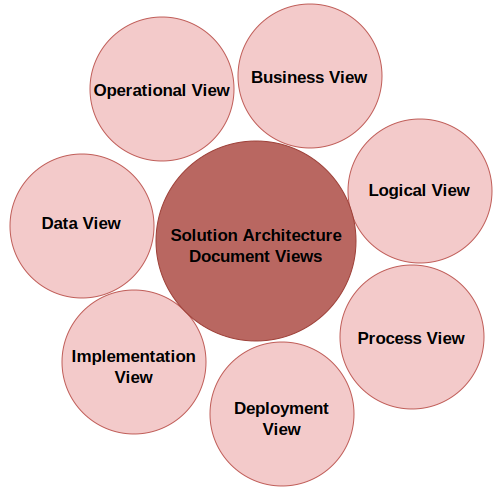

# Solution Architecture Document (SAD)

<a id="contents"></a>

## Contents

1. [Solution Architecture Document](#1-solution-architecture-document)
2. [Purpose of the SAD](#2-purpose-of-the-sad)
3. [Views of the SAD](#3-views-of-the-sad)
   - [3.1 SAD Views Figure](#31-sad-views-figure)
   - [3.2 Business View](#32-business-view)
   - [3.3 Logical View](#33-logical-view)
   - [3.4 Process View](#34-process-view)
   - [3.5 Deployment View](#35-deployment-view)
   - [3.6 Implementation View](#36-implementation-view)
   - [3.7 Data View](#37-data-view)
   - [3.8 Operational View](#38-operational-view)
4. [Structure of the SAD](#4-structure-of-the-sad)
   - [4.1 Solution Overview](#41-solution-overview)
   - [4.2 Business Context](#42-business-context)
   - [4.3 Conceptual Solution Overview](#43-conceptual-solution-overview)
   - [4.4 Solution Architecture](#44-solution-architecture)
   - [4.5 Solution Implementation](#45-solution-implementation)
   - [4.6 Solution Management](#46-solution-management)
   - [4.7 Appendix](#47-appendix)

---

## 1. Solution Architecture Document

During **solution architecture design and optimization**, the solutions architect must maintain consistent communication with stakeholders for successful application delivery.

> The architecture design must be understandable for both technical and non-technical stakeholders.

The **Solution Architecture Document (SAD)** provides an **end-to-end view of the application** and helps everyone stay on the same page. It addresses the needs of all stakeholders associated with the development of the application.

### SAD documentation areas

- **Purpose of the SAD**
- **Views of the SAD**
- **Structure of the SAD**
- **Life cycle of the SAD**
- **SAD best practices and common pitfalls**
- **IT procurement documentation for a solution architecture**
  - Request for Proposal (**RFP**)
  - Request for Information (**RFI**)
  - Request for Quotation (**RFQ**)

Solutions architects also participate in procurement-related documentation by providing input and feedback that support strategic decisions.

[Back to Contents](#contents)

---

## 2. Purpose of the SAD

Architecture documentation is often skipped or delayed, and teams may start implementation without understanding the overall architecture. The SAD provides a **broad view of the overall solution design** and keeps all stakeholders informed.

### Stakeholder usage

- **Project managers** rely on the SAD to oversee project coordination and progress.
- **Business analysts** use it to align the project with business requirements.
- **Technical teams**, including developers and IT professionals, refer to it while implementing and maintaining the proposed solution.
- **Senior management** uses the document to make informed strategic decisions.
- **Clients and end users** depend on the document to confirm that the project outcome meets their needs and expectations.

### SAD goals

The SAD helps to achieve the following goals:

- Communicate the **end-to-end application solution** to all stakeholders.
- Provide a **high-level overview of the architecture** and different views of the application design.
- Address service-quality requirements such as:
  - **Reliability**
  - **Security**
  - **Performance**
  - **Scalability**
- Provide traceability from the solution back to the business requirements.
- Show how the application meets **functional** and **non-functional requirements** (**NFRs**).
- Provide the solution views required for:
  - Design
  - Build
  - Testing
  - Implementation
- Define solution impacts for:
  - Estimation
  - Planning
  - Delivery
- Define the business process, continuation, and operations needed for uninterrupted work after production launch.

### Important SAD content

SADs define the **purpose and goal of the solution** and address critical components that implementation teams may otherwise overlook:

- **Solution constraints**
- **Assumptions**
- **Risks**

The solutions architect should write the document in clear language that business users can understand, while still connecting the business context with the technical design.

> Documentation helps retain knowledge during resource changes and makes the overall design process less dependent on specific people.

### Existing applications and modernization

For existing applications where modernization is needed, the SAD presents:

- An abstract view of the **current architecture**
- An abstract view of the **future architecture**
- A transition plan
- Existing system dependencies
- Potential risks discovered in advance
- Migration tools and technologies
- Resource planning needs for the new system

### Assessments and change record

The solutions architect may conduct assessments during solution design through:

- Proof of concept (**POC**)
- Market research
- Technology evaluation
- Architecture trade-off analysis

A SAD should list architecture assessments, their impact, and the selected technology choices. It should also present the conceptual view of the solution's **current state** and **target state**, while maintaining a change record.

[Back to Contents](#contents)

---

## 3. Views of the SAD

The solutions architect needs to create a SAD that both business and technical users can understand.

The SAD bridges the communication gap between business users and the development team by explaining the function of the overall application. A practical way to capture stakeholder input is to look at the problem from each stakeholder's perspective.

The solutions architect evaluates both **business** and **technical** aspects of architecture design to account for technical and non-technical user requirements.

### 3.1 SAD Views Figure

As illustrated below, a holistic overview of the SAD includes several views that cover different aspects derived from the business requirements.



**Figure: SAD views**

### Diagram note

Solutions architects can choose standard diagrams to represent the views, for example:

- Unified Modeling Language (**UML**) diagrams
- Block diagrams
- Microsoft Visio diagrams

The diagram should be easy to read and understandable for both business and technical stakeholders.

### 3.2 Business View

The **Business View** addresses business concerns and business purpose.

- Shows the value proposition of the overall solution and product.
- Can present high-level business scenarios as a use case diagram.
- Describes stakeholders and required resources to execute the project.
- Can also be treated as a **use case view**.

### 3.3 Logical View

The **Logical View** presents the packages or logical components of the system so that business users and designers can understand the system structure.

- Shows the logical components of the system.
- Explains how multiple packages are connected.
- Shows how the user interacts with the system.
- Can show the order in which parts of the system should be built.

Example for a banking application:

```text
Security package
  -> Account package
  -> Loan package
  -> Other business modules
```

Each package represents a module and can be built as a microservice.

### 3.4 Process View

The **Process View** presents more detail about how critical processes in the system work together.

- Can be reflected with a **state diagram**.
- Can be expanded with a **sequence diagram**.
- In a banking application, it can show processes such as:
  - Loan approval
  - Account approval

### 3.5 Deployment View

The **Deployment View** presents how the application will work in production.

- Shows how connected system components work together, such as:
  - Network firewall
  - Load balancer
  - Application servers
  - Database
- Should be simple enough for business users to understand.
- Can include more detail in a UML deployment diagram for technical users.
- Helps development and DevOps teams understand node components and dependencies.
- Represents the **physical layout of the system**.

### 3.6 Implementation View

The **Implementation View** is the core of the SAD and represents architecture and technology choices.

- Includes the architecture diagram and reasoning.
- Examples:
  - **3-tier architecture**
  - **N-tier architecture**
  - **Event-driven architecture**
- Details technology choices and trade-offs, for example:
  - Java vs. Node.js
  - Pros and cons of each option
- Justifies the resources and skills required to execute the project.

The development team uses the implementation view to create detailed design artifacts, such as class diagrams. Those detailed design artifacts do not always need to be part of the SAD.

### 3.7 Data View

Most applications are data-driven, so the **Data View** is essential.

- Represents how data flows between components.
- Explains how data is stored.
- Can explain data security and data integrity.
- Can use an entity-relationship (**ER**) diagram to show relationships between tables and schemas.
- Also explains reporting and analytics needs.

### 3.8 Operational View

The **Operational View** explains how the system will be maintained after launch.

- Defines service-level agreements (**SLAs**).
- Describes alerting and monitoring.
- Includes the disaster recovery plan.
- Includes the support plan.
- Details how maintenance will be carried out, such as:
  - Deploying bug fixes
  - Patching
  - Backup and recovery
  - Handling security incidents

### Additional views

The listed views help ensure the SAD covers the system and stakeholder concerns. Additional views may be added depending on stakeholder requirements:

- **Physical architecture view**
- **Network architecture view**
- **Security / controls architecture view**

[Back to Contents](#contents)

---

## 4. Structure of the SAD

Use this structure as a reusable SAD skeleton. The exact depth can vary by project size, risk, regulatory expectations, and stakeholder needs.

### 4.1 Solution Overview

- **1.1 Solution Purpose**
- **1.2 Solution Scope**
  - **1.2.1 In Scope**
  - **1.2.2 Out of Scope**
- **1.3 Solution Assumptions**
- **1.4 Solution Constraints**
- **1.5 Solution Dependencies**
- **1.6 Key Architecture Decisions**

### 4.2 Business Context

- **2.1 Business Capabilities**
- **2.2 Key Business Requirements**
  - **2.2.1 Key Business Processes**
  - **2.2.2 Business Stakeholders**
- **2.3 Non-Functional Requirements**
  - **2.3.1 Scalability**
  - **2.3.2 Availability and Reliability**
  - **2.3.3 Performance**
  - **2.3.4 Portability**
  - **2.3.5 Security**

### 4.3 Conceptual Solution Overview

- **3.1 Conceptual and Logical Architecture**

### 4.4 Solution Architecture

- **4.1 Information Architecture**
  - **4.1.1 Information Components**
- **4.2 Application Architecture**
  - **4.2.1 Application Components**
- **4.3 Data Architecture**
  - **4.3.1 Data Flow and Context**
- **4.4 Integration Architecture**
  - **4.4.1 Interface Component**
- **4.5 Infrastructure Architecture**
  - **4.5.1 Infrastructure Component**
- **4.6 Security Architecture**
  - **4.6.1 Identity and Access Management**
  - **4.6.2 Application Threat Model**

### 4.5 Solution Implementation

- **5.1 Development**
- **5.2 Deployment**
- **5.3 Data Migration**
- **5.4 Application Decommissioning**

### 4.6 Solution Management

- **6.1 Operational Management**
  - **6.1.1 Monitoring and Alert**
  - **6.1.2 Support and Incident Management**
  - **6.1.3 Disaster Recovery**
- **6.2 User Onboarding**
  - **6.2.1 User System Requirement**

### 4.7 Appendix

- **7.1 Open Items**
- **7.2 Proof of Concept Findings**

[Back to Contents](#contents)
